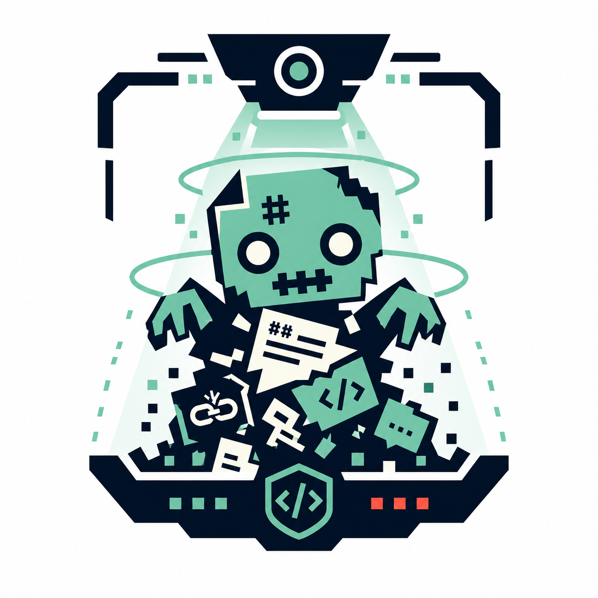
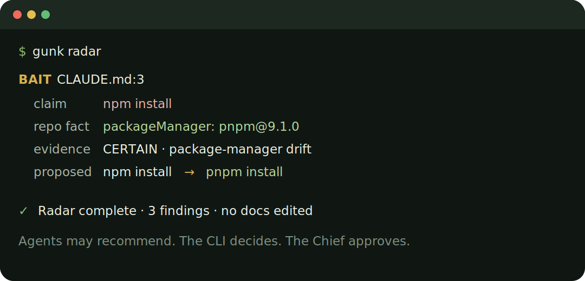

<p align="center">
  
</p>

<p align="center">
  <picture>
    <source media="(prefers-color-scheme: dark)" srcset="assets/readme/hero-dark.svg">
    
  </picture>
</p>

<p align="center">
  Local, deterministic hygiene for the docs and instructions AI coding agents read.<br>
  Find hallucination bait before an agent acts on it.
</p>

<p align="center">
  <a href="LICENSE"></a>
  
  
  
</p>

<p align="center">
  <a href="#see-it">See it</a> ·
  <a href="#quick-start">Install</a> ·
  <a href="#proof-not-promises">Proof</a> ·
  <a href="#how-it-works">Workflow</a> ·
  <a href="#the-safety-moat">Safety</a> ·
  <a href="#documentation">Docs</a>
</p>

---

Your coding agent reads more than code. It reads `AGENTS.md`, `CLAUDE.md`, setup guides, old plans, copied docs, and generated leftovers. When those files disagree with the repository, they become **hallucination bait**: plausible context that sends the agent in the wrong direction.

Gunk Buster checks that agent-readable surface against repository facts. It does not inspect application code, call a model, upload content, assign a magic score, or silently delete anything.

> **Agents may recommend. The CLI decides. The Chief approves.**

## See it

<p align="center">
  
</p>

The example is derived from the repository's package-manager-drift fixture: Radar locates the claim, cites the repository fact that contradicts it, and proposes the smallest mechanical edit. Diagnostic runs do not edit repository content.

## Quick Start

### Codex App and CLI

Install the repository plugin—skills, five read-only MCP tools, and the non-blocking edit advisory arrive together:

```text
codex plugin marketplace add gustavo-meilus/gunk-buster
codex plugin add gunk-buster@gunk-buster
```

Start a fresh task and ask:

```text
check this repo for stale context
```

No manual MCP registration is required. The same plugin is used by the Codex desktop app and CLI.

### Claude Code

```text
/plugin marketplace add gustavo-meilus/gunk-buster
/plugin install gunk-buster@gunk-buster
```

Restart the session after installation, then use the same unnamed prompt or invoke `/gunk-scan` or `/gunk-radar` directly.

### CLI

The plugin is deliberately read-only. Trapping, restoring, and applying approved fixes require the separately installed `gunk` CLI. Until the first npm release is published, install it from a clone:

```bash
git clone https://github.com/gustavo-meilus/gunk-buster.git
cd gunk-buster
corepack enable
pnpm install --frozen-lockfile
pnpm build
npm install --global .
```

Then establish a baseline:

```bash
gunk scan
gunk radar
gunk pile
```

See the full [installation guide](docs/INSTALL.md) for updates, removal, platform status, and the separation between plugin and CLI capabilities.

## Proof, not promises

Gunk Buster ships with recorded evidence, not a universal “saves tokens” claim.

### The plugin changes agent behavior

In a fresh Codex CLI task, the byte-identical unnamed prompt automatically invoked the plugin-managed `gunk_radar` MCP tool. The prompt never named Gunk Buster, Radar, a skill, or an MCP tool. The run exited successfully and left the worktree unchanged.

### Matched tool-exposure observation

Two runs used the same commit, worktree, prompt, model, effort, harness, and host six minutes apart. The only isolated difference was whether the plugin's MCP tools were available:

| Metric | Tools absent | Tools present | Delta |
| --- | ---: | ---: | ---: |
| Wall clock | 122.4s | 108.6s | **−11.3%** |
| Reasoning output | 813 | 693 | **−14.8%** |
| Answer output | 5,782 | 4,766 | **−17.6%** |
| Shell commands | 18 | 15 | **−16.7%** |
| Uncached input | 58,144 | 57,432 | −1.2% |
| Total input | 317.7K | 408.7K | +28.6% |

The tools-present answer covered all five requested elements, was 34% shorter, and surfaced a duplicated skill that the control missed. It also challenged Radar's output instead of accepting every finding.

### Independent context-cleanup experiment

On a difficult 398-file repository with 338 structural findings and 505 Radar findings, three medium-effort runs per condition showed **12.2% lower median wall time** and **12.1% lower reasoning output** after filtering identified context gunk. Total input rose 6.8%, and high-effort runs regressed.

These are proof-of-concept observations, not performance guarantees. Agent paths vary; cached input dominated several runs; the matched pair is a single observation; and the result depends on model and reasoning effort. Read the [context-cleanup methodology and raw runs](docs/verification/context-cleanup-benchmarks.md) and the [Codex activation proof](docs/verification/mvp-5-codex-proof.md).

## How it works

```text
gunk scan   → structural evidence: orphan docs, dumps, duplicates, broken links
gunk radar  → factual contradictions: dead paths, bad commands, package-manager drift
gunk pile   → grouped human view
gunk report → Markdown report
gunk trap   → Chief-approved move to an external vault, with a receipt
gunk restore / verify → byte-identical recovery and damage checks
```

`scan` finds structural problems. `radar` finds claims in docs and agent instructions that repository facts contradict. Both are deterministic; neither uses an LLM.

### Labels describe; verdicts prescribe

| Label | What was found |
| --- | --- |
| `GHOST` | Orphaned documentation or an unreferenced asset |
| `DUMP` | Generated output, cache, coverage, or tool residue |
| `ECHO` | Duplicated documentation |
| `RELIC` | Sensitive orphaned material that always needs review |
| `BAIT` | Wrong or misleading agent instructions |
| `MOLD` | Documentation contradicted by current repository facts |

| Verdict | What to do |
| --- | --- |
| `SAFE` | Certain evidence and no safety concern; may be batch-trapped after confirmation |
| `PROPOSE` | Plausibly stale; Chief decides |
| `ASK_CHIEF` | Sensitive, recent, or protected; interactive approval is mandatory |
| `KEEP` | Healthy, insufficient evidence, or explicitly retained |

Labels and verdicts are intentionally separate. Broken links and Radar claim findings describe a concrete inconsistency and propose an edit; they are never trapped.

## The safety moat

| Gunk Buster does | Gunk Buster does not |
| --- | --- |
| Analyze docs, agent instructions, referenced assets, and generated artifacts | Analyze source code, imports, ASTs, or dead code |
| Produce explicit `CERTAIN`, `STRONG`, or `WEAK` evidence | Produce numeric “gunk scores” or fake precision |
| Move approved files outside agent reach with receipts | Delete files silently or hide them in an in-repo archive |
| Restore trapped files byte-for-byte | Stage, commit, or push Git changes |
| Expose read-only MCP tools | Expose trap, restore, or automatic fixes through MCP |
| Run locally with no telemetry or cloud service | Call a model or upload repository content |

Mutations remain visible terminal workflows. A content hash prevents acting on a file that changed after it was judged; every trap has a restore command; `verify` checks whether the mutation caused damage.

The Claude Code `gunk-auditor` profile requests a read-only tool allowlist, but current plugin-loaded subagent behavior does not enforce that allowlist as a structural security boundary. The MCP tools themselves remain read-only. Track the upstream-dependent limitation in [issue #37](https://github.com/gustavo-meilus/gunk-buster/issues/37).

Read the full [safety model](docs/SAFETY.md).

## Agent surfaces

| Surface | Status | What ships |
| --- | --- | --- |
| Gunk CLI | Implemented and tested | Full deterministic engine and Chief-approved mutations |
| Codex CLI | Verified | Skills, five read-only MCP tools, advisory hook |
| Codex desktop | Verified smoke lifecycle | Same repository plugin |
| Codex IDE | Available, dedicated lifecycle waived | Same repository plugin; no separate transcript |
| Claude Code | Implemented | Skills, MCP, advisory hook, auditor profile with the limitation above |

Windows 11 is the manually certified MVP platform. The implementation is portable Node.js, but macOS and Linux do not yet have equivalent manual certification records.

## Architecture

```text
                 ┌─ CLI: scan, radar, pile, report, trap, restore, verify
deterministic    ├─ MCP: five read-only diagnostic tools
TypeScript core ├─ skills: when and how agents use the core
                 └─ hooks: advisory warnings, never enforcement
```

The CLI core is the single source of truth. Plugins and skills are distribution shells; they do not reimplement detection or safety policy. See the [roadmap](ROADMAP.md), [domain vocabulary](CONTEXT.md), and [architecture decisions](docs/adr/README.md).

## Documentation

- [Installation and updates](docs/INSTALL.md)
- [CLI and configuration reference](docs/CLI.md)
- [Safety, vaults, receipts, and trust boundaries](docs/SAFETY.md)
- [Architecture decision index](docs/adr/README.md)
- [Agent skills](skills/README.md)
- [Context Benchmark evidence](docs/verification/context-cleanup-benchmarks.md)
- [Codex proof record](docs/verification/mvp-5-codex-proof.md)
- [Product roadmap](ROADMAP.md)
- [Contributing](CONTRIBUTING.md)
- [Security policy](SECURITY.md)

## Contributing

Bug reports, focused fixes, documentation improvements, and detector proposals are welcome. Read [CONTRIBUTING.md](CONTRIBUTING.md) before opening a pull request. Please use [GitHub Issues](https://github.com/gustavo-meilus/gunk-buster/issues) for bugs and proposals, and report vulnerabilities through the process in [SECURITY.md](SECURITY.md).

## License

MIT © 2026 Gustavo Meilus. See [LICENSE](LICENSE).

---

If Gunk Buster caught hallucination bait in your repo, star it and share the finding. Chief deserves clean context.
